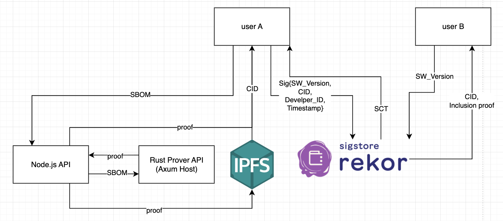

# Getting started with zkVM-server
There're three components in our project.
- Node-API
- Rust Prover API
- IPFS
## Architecture Overview
For a simple case, the user sends an SBOM to our zkVM server. The Node.js  API receives the SBOM and forwards it to the Axum Host for proof generation.
After the Axum Host guest code generates the proof, the host code verifies it. The Axum Host then returns the proof to the Node.js  API. The Node.js  API sends the proof back to the user and also uploads it to IPFS.

We are currently working on a transparency log implemented with the Sigstore architecture. The overall system architecture will be updated in the near future—please stay tuned!

